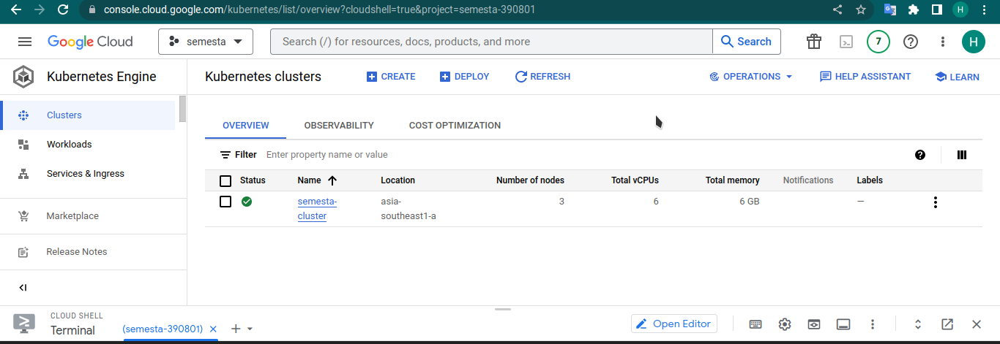
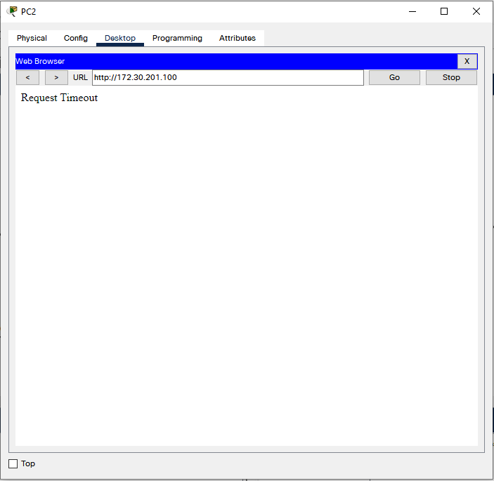
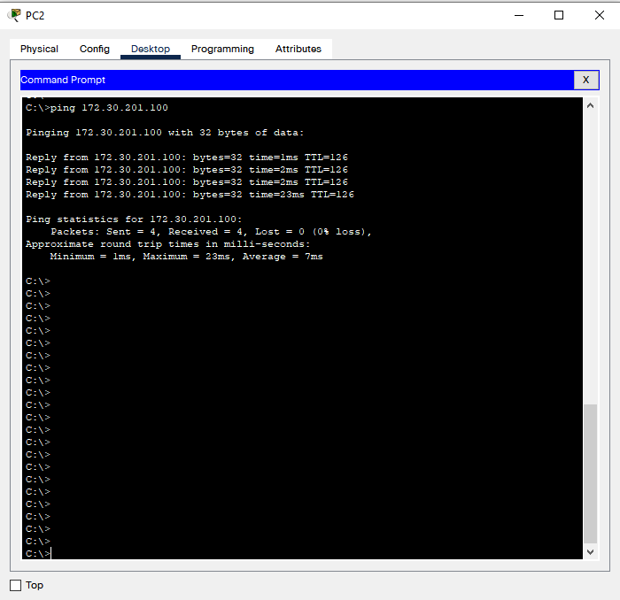
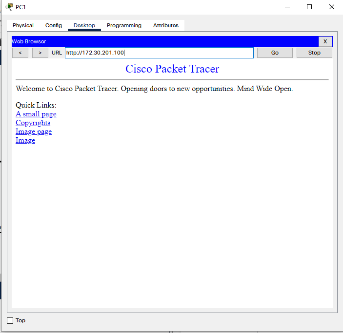
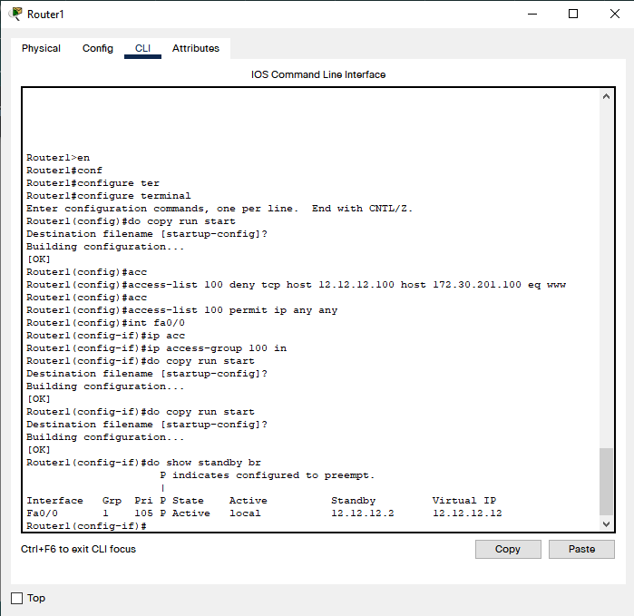
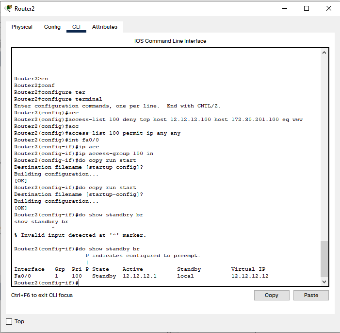

# 🕹️ Project Hackathon System Administrator SEMESTA Batch 5

Nama: Hary Miftah Fauzan

Asal Sekolah: SMKN 2 Tasikmalaya

## 📝 Deskripsi Project
Project ini dibangun 80 persen di lingkungan Google Cloud Provide (GCP), dengan topologi atau arsitektur sebagai berikut:

Terdapat 2 tipe:
1. User
    - User adalah orang yang mengakses website dari internet. Alur topologi bagi user yaitu:
        * User mengetikkan url https://semesta.unvizy.xyz
        * Kemudian oleh DNS akan diarahkan ke Ingress global https
        * Setelah diarahkan ke service app1
        * kemudian dari service app1 akan diarahkan ke dalam pod app1
        * jika user mengakses menggunakan endpoint /aboutus, maka pod app1 akan melakukan request ke service app2
        * oleh service app2 akan diarahkan ke pod app2

2. Developer 
    - adalah orang yang melakukan develope website tersebut. Alur untuk developer sebagai berikut:
        * Developer melakukan push source code ke github repository
        * Jenkins melakukan pull source code
        * Jenkins melakukan job pipeline, diantaranya:
            * checkout
            * test source code
            * build docker image
            * push docker image ke docker registry
            * deploy aplikasi ke kubernetes cluster

Server Jenkins diinstall menggunakan Google Cloud Compute, proses provisioning server menggunakan Terraform dan untuk setup server nya menggunakan Ansible

### Berikut tampilan hasil akses website nya:

- Akses https://semesta.unvizy.xyz
    
- Akses https://semesta.unvizy.xyz/aboutus
    

## 🚀 Cara Menggunakan Project
### Kubernetes Cluster
Buat terlebih dahulu kubernetes cluster nya.
Saya di sini menggunakan Google Kubernetes Engine (GKE)
        

        
### Persipkan server Jenkins. 
Server Jenkins dibangun menggunakan terraform, dan ansible

### Jenkins pipeline

## 🌐 Deskripsi Project Cisco Packet Tracer
Architectfure network dengan HA dan juga etherchannel. Tidak lupa access control list untuk melakukan filtering traffic.
Filtering traffic. digunakan agar PC2 tidak dapat mengakses website.

untuk ping, PC2 diizinkan melakukan ping ke server
web.

Akses PC1 ke Website:

HA pada Router1

HA pada Router2
